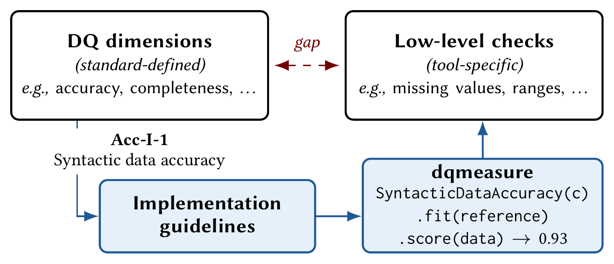
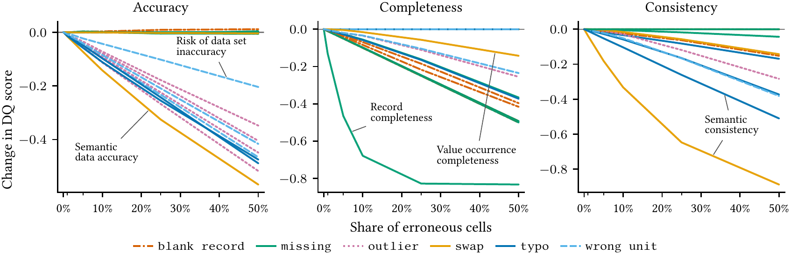
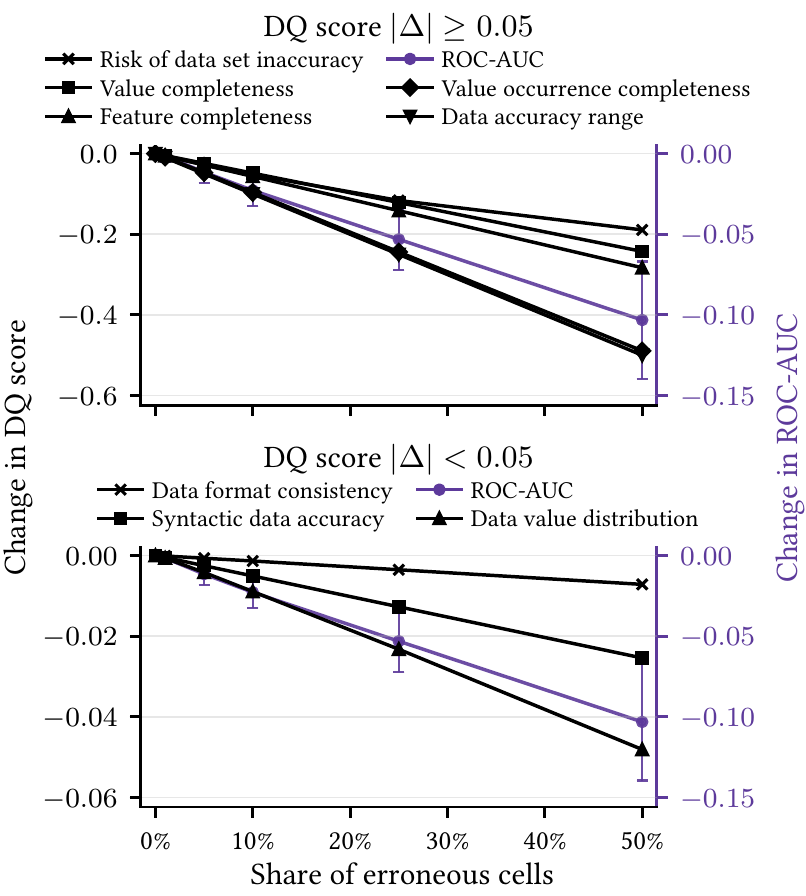

<h1 align="center">dqmeasure</h1>

<p align="center">Code for <em>"Implementation Guidelines for Data Quality Metrics"</em>: the data quality metrics of ISO/IEC 25024 and ISO/IEC 5259 as fit/score estimators.</p>

<p align="center">[<a href="https://calgo-lab.de/dqmeasure/">Documentation</a>] [<a href="#">Paper (arXiv, waiting for submission)</a>]</p>

<p align="center"></p>

Despite decades of data quality (DQ) research, a gap remains between DQ
dimensions, such as accuracy or completeness, which the literature defines in
textual form, and DQ tools, which typically implement low-level checks that
are not aligned with these dimensions. ISO/IEC 25024 and ISO/IEC 5259 attempt
to bridge this gap by defining DQ metrics for each dimension. However, these
DQ metrics are hardly used, because the standards leave open how to implement
them: for example, the metric for syntactic accuracy counts syntactically
accurate values, but does not state how to decide that a value is
syntactically accurate.

We make the ISO DQ metrics executable. We classify all data-level metrics of
both standards into (i) generalizable metrics that need no input beyond the
data, (ii) parameterized metrics whose parameters can be learned from clean
reference data or set by an expert, and (iii) non-generalizable metrics that
need qualitative judgment and cannot be automated. For categories (i) and
(ii), we propose implementation guidelines that resolve what the standards
leave open, and realize them in `dqmeasure`, a library of 20 metrics that
learns these parameters from reference data instead of relying on manually
defined rules. On real-world datasets, the metric scores decrease
monotonically as more errors are injected, decline together with downstream
ML performance, and take time linear in the number of rows.

## Method

Each metric is a scikit-learn-style estimator on one column or on the whole table
(the library calls the metrics measures):

- `fit(reference)` learns the metric's parameters from a clean instance of
  the table, e.g., the domain of syntactically accurate values for `Acc-I-1`,
  or the admissible interval for `Acc-I-7`. An expert can set any parameter in
  the constructor instead, and a metric with all parameters set needs no `fit`.
- `predict(data)` returns the per-value result, e.g. whether each cell is
  syntactically accurate.
- `score(data)` returns the metric's value as the standard defines it, one
  float in [0, 1] where higher is better.

The [model document](https://calgo-lab.de/dqmeasure/dqmeasure-model/) states
how each ISO concept maps onto a dataframe and the assumptions behind it;
every class docstring states how its metric resolves what the standard leaves
open.

## Results

The paper reports three experiments. [`experiments/`](experiments/) holds
the code, the published measurements and the notebooks that turn them into
the paper's tables and figures. We split the HOSP dataset into five
folds, fit every metric on the clean training folds, inject six kinds of
errors into the test fold at rates up to 50% and score it:

<p align="center"></p>

Each line is one metric under one kind of error, as the mean change in score
from the clean data over the corrupted columns. The scores fall monotonically
as the error rate grows. `RiskOfDataInconsistency` is left out, since it is
the one score that rises under corruption. Computed by
[`experiments/notebooks/data_quality_measurement.ipynb`](experiments/notebooks/data_quality_measurement.ipynb).

The second experiment corrupts the SynTabFall dataset with its own error
scenario and also trains a classifier on it. The scores decline together with the
classifier's ROC-AUC:

<p align="center"></p>

Each black line is one metric's change in score from the clean data, and the
purple line is the classifier's change in ROC-AUC on the right-hand axis,
with whiskers for the standard deviation over the five folds. Computed by
[`experiments/notebooks/downstream_performance.ipynb`](experiments/notebooks/downstream_performance.ipynb).

The third experiment shows that computing the metrics takes time linear in
the number of rows, measured on the 2024 NYC taxi trips.

## Quickstart

You need [uv](https://docs.astral.sh/uv/). The figures are set in the
paper's fonts, so you'll also need a LaTeX installation with the `libertine`
package. Without one, set `"text.usetex": False` in
[`experiments/notebooks/figures.py`](experiments/notebooks/figures.py).

Install the library and the experiments:

```bash
uv sync --all-packages
```

### Regenerate the figures and tables

The measurements behind the paper are committed in
[`experiments/measurements/`](experiments/measurements/). Three notebooks
turn them into the paper's figures and tables, which they write to
`experiments/results/`:

```bash
cd experiments/notebooks
uv run jupyter execute data_quality_measurement.ipynb downstream_performance.ipynb scalability.ipynb
```

To read them interactively instead, run `uv run jupyter lab experiments/notebooks`
from the repository root.

### Rerun the experiments

From the repository root, download the datasets and run the first two
experiments:

```bash
uv run get-datasets
uv run run-sweep
uv run run-sweep --experiment downstream-performance
```

A sweep writes one `results.parquet` per run to `experiments/results/` and
skips runs that already exist, so it can be resumed. The published
measurements also cover `SemanticDataAccuracy`, which asks an LLM: put
your [OpenRouter](https://openrouter.ai/) key in `.env` as
`OPENAI_API_KEY=...` and add `--llm`, e.g.
`uv run --env-file .env run-sweep --llm`. We ran our experiments with DeepSeek V4 Flash through OpenRouter.

The scalability experiment times every metric on up to all of the 2024 NYC
taxi trips. A small local run on one month:

```bash
uv run prepare-nyc-taxi --data-dir experiments/data --months 1
uv run run-scalability --sweep rows --max-size 10000
```

To plot your own runs, replace `../measurements` with `../results` in the
`RESULTS` path at the top of a notebook.
[`experiments/README.md`](experiments/README.md) describes the full sweeps
and how we ran them on Kubernetes.

## Repository

This is a [uv](https://docs.astral.sh/uv/) workspace with two members:

- [`packages/dqmeasure`](packages/dqmeasure/) is the library, with only
  Narwhals and Polars as dependencies. Its README shows how to use it and
  lists the test, lint and docs commands.
- [`experiments`](experiments/) consumes the library: dataset download, error
  injection with [`tab_err`](https://github.com/calgo-lab/tab_err), the sweeps
  behind the paper and the notebooks.

## Citation

```bibtex
@article{jung2026dqmeasure,
      title={Implementation Guidelines for Data Quality Metrics},
      author={Jung, Philipp and Becker, Katinka and Biessmann, Felix and Restat, Valerie and Seyferth, Martin and Schwabe, Daniel and Ehrlinger, Lisa},
      journal={arXiv preprint arXiv:XXXX.XXXXX},
      year={2026}
}
```

## License

[Apache 2.0](LICENSE).
